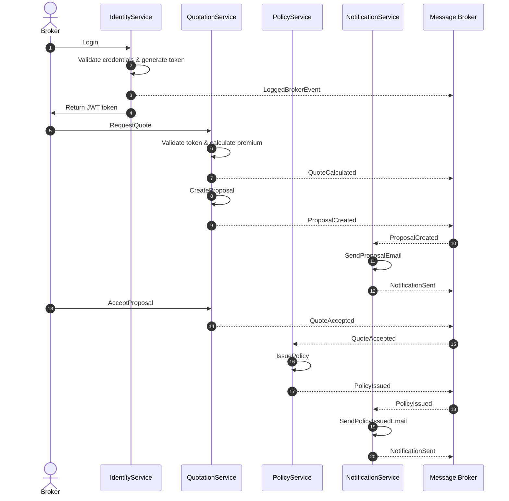

import Footer from '@catalog/components/footer.astro';

## Overview

This flow describes the happy path for issuing an insurance policy in Yosef — from the moment a Broker logs in to the moment the Insured receives their policy document.

## Sequence Diagram

<Footer />
