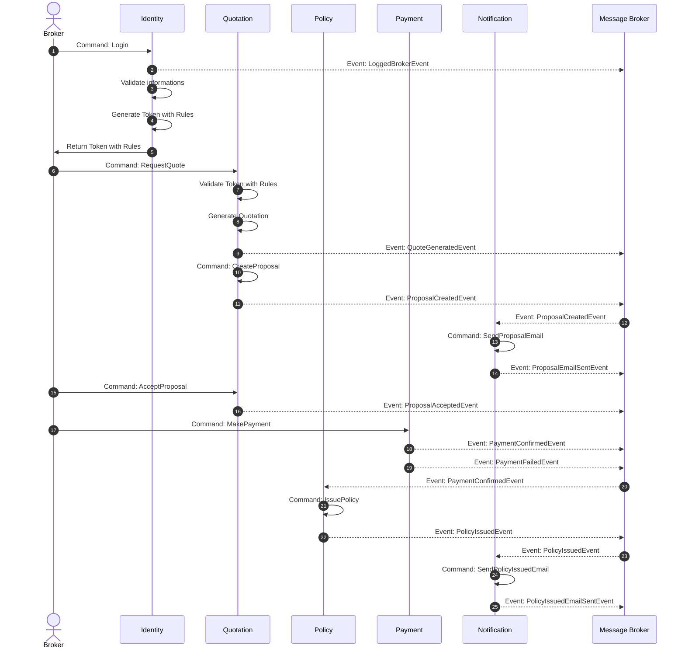

# Policy Constracting Process

```mermaid
sequenceDiagram
    autonumber

    %% Actors
    actor Broker as Broker
    participant Identity as Identity
    participant Quotation as Quotation
    participant Policy as Policy
    participant Payment as Payment
    participant Notification as Notification
    participant BrokerSystem as Message Broker

    Broker ->> Identity: Command: Login
    Identity -->> BrokerSystem: Event: LoggedBrokerEvent
    Identity ->> Identity: Validate informations
    Identity ->> Identity: Generate Token with Rules
    Identity ->> Broker: Return Token with Rules

    Broker ->> Quotation: Command: RequestQuote
    Quotation ->> Quotation: Validate Token with Rules
    Quotation ->> Quotation: Generate Quotation
    Quotation -->> BrokerSystem: Event: QuoteGeneratedEvent

    Quotation ->> Quotation: Command: CreateProposal
    Quotation -->> BrokerSystem: Event: ProposalCreatedEvent

    BrokerSystem -->> Notification: Event: ProposalCreatedEvent
    Notification ->> Notification: Command: SendProposalEmail
    Notification -->> BrokerSystem: Event: ProposalEmailSentEvent

    Broker ->> Quotation: Command: AcceptProposal
    Quotation -->> BrokerSystem: Event: ProposalAcceptedEvent

    Broker ->> Payment: Command: MakePayment
    Payment -->> BrokerSystem: Event: PaymentConfirmedEvent
    Payment -->> BrokerSystem: Event: PaymentFailedEvent

    BrokerSystem -->> Policy: Event: PaymentConfirmedEvent
    Policy ->> Policy: Command: IssuePolicy
    Policy -->> BrokerSystem: Event: PolicyIssuedEvent

    BrokerSystem -->> Notification: Event: PolicyIssuedEvent
    Notification ->> Notification: Command: SendPolicyIssuedEmail
    Notification -->> BrokerSystem: Event: PolicyIssuedEmailSentEvent
```