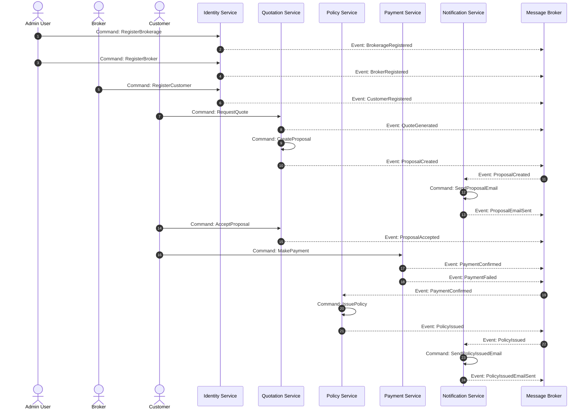

# Policy Constracting Process

```mermaid
sequenceDiagram
    autonumber

    %% Actors
    actor Admin as Admin User
    actor Broker as Broker
    actor Customer as Customer
    participant Identity as Identity Service
    participant Quotation as Quotation Service
    participant Policy as Policy Service
    participant Payment as Payment Service
    participant Notification as Notification Service
    participant BrokerSystem as Message Broker

    %% 1. Register Brokerage
    Admin ->> Identity: Command: RegisterBrokerage
    Identity -->> BrokerSystem: Event: BrokerageRegistered

    %% 2. Register Broker
    Admin ->> Identity: Command: RegisterBroker
    Identity -->> BrokerSystem: Event: BrokerRegistered

    %% 3. Register Customer
    Broker ->> Identity: Command: RegisterCustomer
    Identity -->> BrokerSystem: Event: CustomerRegistered

    %% 4. Quotation Request
    Customer ->> Quotation: Command: RequestQuote
    Quotation -->> BrokerSystem: Event: QuoteGenerated

    %% 5. Proposal Creation
    Quotation ->> Quotation: Command: CreateProposal
    Quotation -->> BrokerSystem: Event: ProposalCreated

    %% 6. Send Proposal by Email
    BrokerSystem -->> Notification: Event: ProposalCreated
    Notification ->> Notification: Command: SendProposalEmail
    Notification -->> BrokerSystem: Event: ProposalEmailSent

    %% 7. Customer Accepts Proposal
    Customer ->> Quotation: Command: AcceptProposal
    Quotation -->> BrokerSystem: Event: ProposalAccepted

    %% 8. Payment Execution
    Customer ->> Payment: Command: MakePayment
    Payment -->> BrokerSystem: Event: PaymentConfirmed
    Payment -->> BrokerSystem: Event: PaymentFailed

    %% 9. Policy Issuance
    BrokerSystem -->> Policy: Event: PaymentConfirmed
    Policy ->> Policy: Command: IssuePolicy
    Policy -->> BrokerSystem: Event: PolicyIssued

    %% 10. Send Policy Confirmation Email
    BrokerSystem -->> Notification: Event: PolicyIssued
    Notification ->> Notification: Command: SendPolicyIssuedEmail
    Notification -->> BrokerSystem: Event: PolicyIssuedEmailSent

```